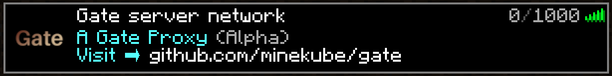



# Minekube Gate documentation

Gate is an [open source](https://github.com/minekube/gate) batteries-included,
extensible, high performant & paralleled Minecraft proxy - _ready for the cloud_!

Gate can run locally as a tiny single binary, in a Docker container or
alongside your organization's growing demands in a remote Kubernetes-orchestrated
production environment in your cloud.



  Get started
  View the tutorials




Gate is written in [Go](https://go.dev/),
a fast, reliable, efficient, statically typed, compiled programming language designed at Google.



***

## Installing the Gate CLI binary

### Downloading a pre-built binary

You can download the latest pre-built binary for your operating system from the [release page](https://github.com/minekube/gate/releases).


Downloads




| OS            | Binary Name with Processor                        |
|---------------|---------------------------------------------------|
| Windows       | `windows_arm64`, `windows_amd64` or `windows_386` |
| MacOS (Apple) | `darwin_amd64` or `darwin_arm64`                  |
| Linux         | `linux_arm64`, `linux_amd64` or `linux_386`       |



After you have downloaded the binary make sure it is accessible from your `PATH` environment variable
and the file has execution permissions.

### Install using Go

Since [`Gate`](https://github.com/minekube/gate) is a Go module you can easily install the latest release.
To run the following command ensure you have [`Go`](https://go.dev/doc/install), and [`Git`](https://www.atlassian.com/git/tutorials/install-git) installed.

```sh
$ go install go.minekube.com/gate@latest
```

***

## Why do you need a Minecraft proxy?

### Use-cases

* You want to keep players connected to the proxy to move them between your different game servers like they would change the world.
* You want to enable cross game server plugins that e.g. handle player chat events or register proxy-wide commands
  broadcast messages and more.
* You want to intercept and log packets on the network traffic between players and servers

### How does a Minecraft proxy work?

Gate presents itself as a normal Minecraft server in the player's server list,
but once the player connects Gate forwards the connection to one of the actual
game servers (e.g. Minecraft vanilla, paper, spigot, sponge, etc.) to play the game.



The player can be moved around the network of Minecraft servers **without**
fully disconnecting, since we want the player to stay connected (and not want
them to re-login via the server-list every time).

Therefore, Gate reads all packets sent between players (Minecraft client) and
upstream servers, logs session state changes, emits different events like
[Login, Disconnect, ServerConnect, Chat, Kick etc.](https://github.com/minekube/gate/blob/master/pkg/proxy/events.go)
that custom plugins/code can react to.

The **advantages** for using a proxy are far-reaching depending on your use-case.

***

## Why Gate?

**Some of Gate's advantages:**

- Fast and needs less resources (CPU/Memory) leading to improved scalability
- Excellent protocol version support
  - Allows newest version down to 1.7
  - Forge support (for modded servers)
  - BungeeCord compatible plugin channels
  - BungeeCord or Velocity's player info forwarding
- A simple API for plugins/extensions
  - Extend with [your Go code](https://github.com/minekube/gate/tree/master/examples/extend/simple-proxy)
  - Or use a [script language](https://github.com/minekube/gate/issues/9)
- Perfect for Go developers - Gate and developers immensely benefit from the Go language and its wide ecosystem

Similar to the Minecraft proxies written in Java: BungeeCord, Waterfall and Velocity
_(where much of the knowledge comes from)_
Gate delivers a rich interface to interact with connected players
on your cluster of Minecraft servers.



_"Why not use an existing proxy written in Java?"_

Because the less Java a smart Go developer needs to maintain, the happier the Go developer.
Since Go developers work in a very fast-paced and cloud-centric ecosystem with a lot of modern
software written in Go there is simply no cognitive space and time left for Java, [where
everything is bigger](https://youtu.be/PAAkCSZUG1c?t=317).

_The ONLY Java code you must write is for Paper/Spigot/Minestom plugins,
since there is no Go Minecraft server implementation because
no one can keep up to date fast enough with Mojang's quick releases
of new vanilla server versions breaking the protocol everytime._



## Target users audience
Gate supports small and large Minecraft networks with a lot of concurrent players
as well as developers **that already (or want to) have a Go code base**
for their Minecraft related workloads.

_If you already have all your code base in Java and/or need to
use plugins for those other proxies, just stay there._
Gate is for the Go ecosystem and does not have all the convenient
plugins published on SpigotMC!

Although Gate targets better performance, has more version support
(modded servers) and has a simpler API than the BungeeCord Java proxy,
and Gate lets you write extension code in the awesome Go programming language.
